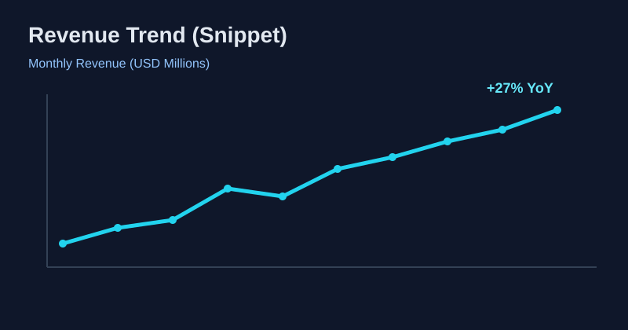
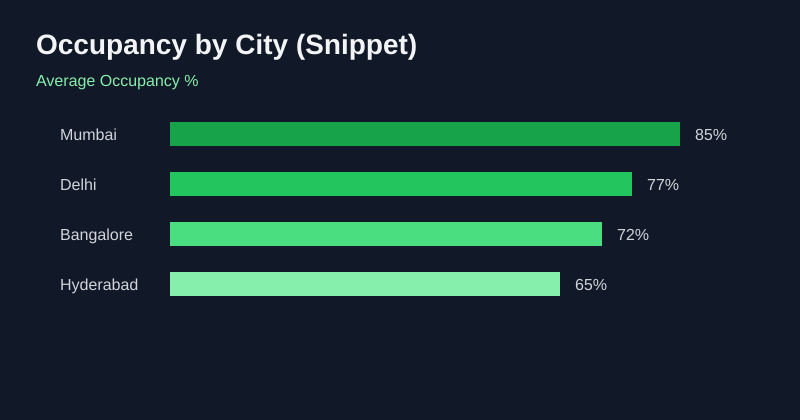
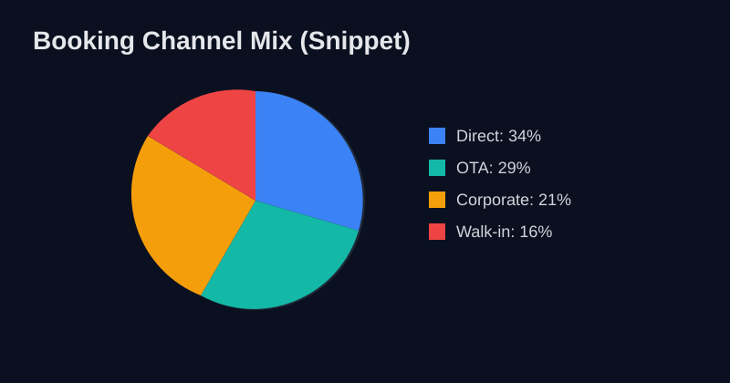

# 🏨 Hotel Chain Dashboard (Power BI)

A business intelligence dashboard built to analyze **hotel chain operations, bookings, occupancy, and financial performance** using Power BI.

> Dataset Credits: Kaggle & Codebasics

---

## 🔗 Live Dashboard

👉 **Power BI Report:**  
[Open Interactive Dashboard](https://app.powerbi.com/groups/me/reports/cd594702-c973-47bf-9edc-050f51b02872/cd4a3446de45837289c0?experience=power-bi)

---

## 📌 Project Highlights

- End-to-end operational view across properties, cities, and booking channels.
- KPI tracking for revenue, occupancy, and booking behavior.
- Insight-driven layout to support leadership decisions on pricing and demand.
- Clean visual storytelling for both business and technical stakeholders.

---

## 📸 Dashboard Snippets

> These preview snippets are representative visuals to showcase the style and analytical focus of the dashboard.

### Revenue Trend Analysis

### Occupancy Performance by City

### Booking Channel Mix

---

## 🧠 Key Business Questions Answered

- Which cities and properties drive the highest revenue?
- How does occupancy trend over time and across locations?
- Which booking channels contribute most to demand?
- Where can pricing and distribution strategy be optimized?

---

## 🛠️ Tools & Stack

- **Power BI** (Data modeling, DAX, dashboarding)
- **Excel/CSV datasets** (data source)
- **GitHub** (project documentation and version control)

---

## 🚀 Repo Impact Notes

If you'd like, I can also add:
- a dark-themed banner/header image,
- a KPI summary card section,
- and a "How to Navigate the Dashboard" guide for recruiters and stakeholders.
